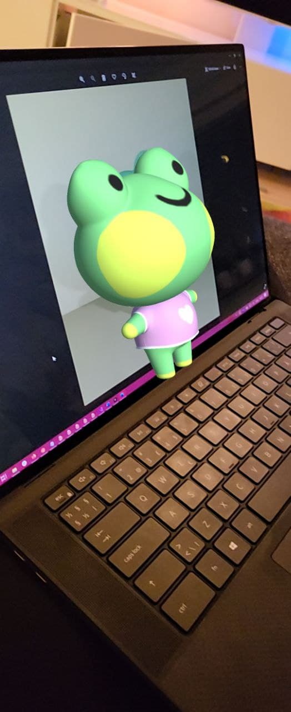

## 02 - Augmented Images
A project made for displaying a 3D model on detected image using ARCore.

#### Topics
- how to use Reference Image Library
- how to configure prefab to be displayed on an image

#### Some screenshots

<em>Screenshot of the built app.</em>
  

<em>A gif animation showing how the app works.</em>

