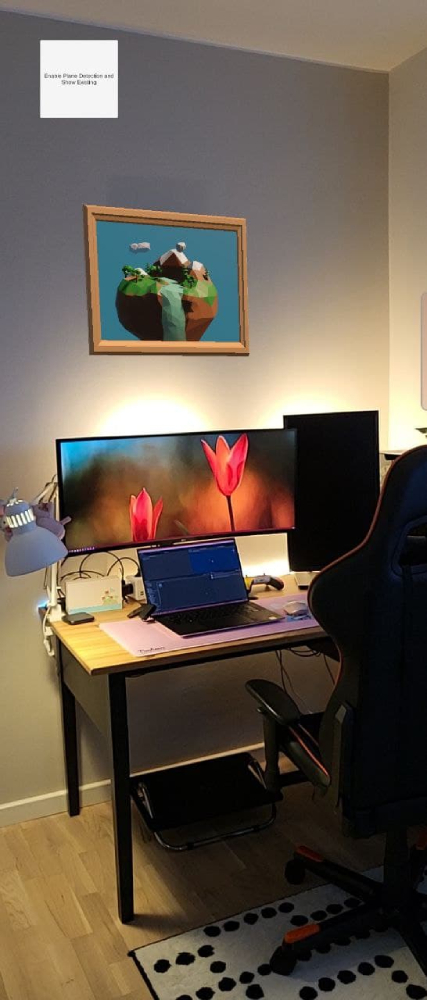

## 03 - Detecting Planes
A project made for displaying a 3D model on detected wall using ARCore.

#### Topics
- how to use Plane Detection
- how to use UI elements with AR apps

#### Some screenshots

<em>Screenshot of the built app.</em>
  

<em>A gif animation showing how the app works.</em>
